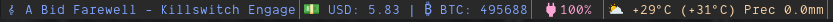

# tmux-currency 📈💰

A Tmux plugin that displays (almost)real-time currency exchange rates in the
status bar, powered by [AwesomeAPI](https://docs.awesomeapi.com.br/api-de-moedas).


---

## 📥 Installation

### 🔹 Using TPM (Tmux Plugin Manager)

If you use [TPM](https://github.com/tmux-plugins/tpm), add the
following line to your `.tmux.conf`:

```tmux
set -g @plugin 'ybarsotti/tmux-currency'
```

Then, reload Tmux and install the plugin:

```shell
tmux source ~/.tmux.conf
```

`<tmux-prefix> + I`

### 🔹 Manual Installation

Clone the repository into your Tmux plugins directory (usually ~/.tmux/plugins/):

```shell
git clone https://github.com/ybarsotti/tmux-currency ~/.tmux/plugins/tmux-currency
```

Then, add this line to your .tmux.conf:

```shell
run-shell ~/.tmux/plugins/tmux-currency/tmux-currency.tmux
```

### 🔹 Update config file

Update the `.tmux.conf` file adding the key into the status

```shell
set -g status-right "#{currency}"
```

Reload Tmux:

```shell
tmux source ~/.tmux.conf
```

## ⚙️ Configuration

You can customize the plugin by setting the following Tmux options in your .tmux.conf:

| Option                         | Default | Description                                                      |
| ------------------------------ | ------- | ---------------------------------------------------------------- |
| @tmux-currency-currencies      | USD-BRL | A comma-separated list of currency pairs (e.g., USD-BRL,BTC-BRL) |
| @tmux-currency-update-interval | 60      | Update interval in seconds                                       |

Example configuration:

```shell
set -g @tmux-currency-currencies "USD-BRL,BTC-BRL"
set -g @tmux-currency-update-interval 30
```

## 🖥️ Screenshots



## 🛠️ How It Works

1. The plugin fetches exchange rates from [AwesomeAPI](https://docs.awesomeapi.com.br/).
2. It processes the response and formats the data for display.
3. The formatted currency rates are displayed in the Tmux status bar.
4. Updates occur at the interval set in @tmux-currency-update-interval.
5. It caches prices according to the interval set

## 📝 License

This project is licensed under the MIT License.
See the [LICENSE](./LICENSE) file for details.

## 📄 Credits

- Thanks to [AwesomeAPI](https://awesomeapi.com.br/) for providing the APIs ❤️
